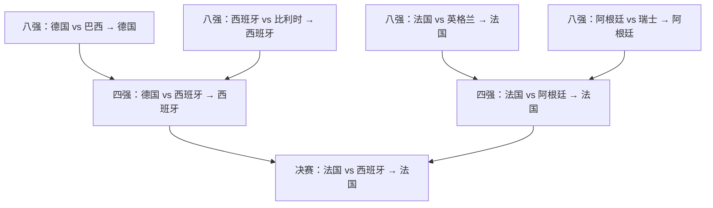

# 2026年世界杯结果预测报告

## 执行摘要

以截至 **2026-06-10（东京）** 能检索到的公开信息为基准，我的主线预测是：**法国夺冠，西班牙亚军，德国季军**。这不是简单照抄赔率，而是把 **主流市场赔率、Opta 赛前模拟、官方名单、实时伤病/缺阵、热身赛状态、赛程路径与历史世界杯表现** 叠加后的单路径预测。检索证据层面，**Opta** 赛前模拟把西班牙列为头号热门（16.1%），法国第二（13.0%）；**Oddschecker** 的冠军市场则把西班牙、法国放在同一最短档附近，差距并不大。我的最终修正，是因为法国核心可用性和阵容深度更稳，而西班牙虽然上限极高，但 **Lamine Yamal / Nico Williams / Víctor Muñoz 的恢复进度** 与高温赛程的不确定性，仍让我把法国略微抬到第一。citeturn26view1turn35view1turn21view4turn21view5turn25news39turn23view0

我对 **巴西** 的态度要比主流市场更谨慎。检索到的赛前伤停信息显示：**Wesley** 已退出、**Neymar** 有小腿伤、**Eder Militão / Rodrygo / Estevão** 已因伤落选，而路透赛前报道也明确指出巴西后防和右后卫位存在结构性不确定性。相较之下，**葡萄牙** 以 Nations League 之后的良好势头与中场深度进入世界杯，因此我把葡萄牙的综合夺冠概率排在巴西之前。citeturn20view3turn20view5turn19search3turn41view1

## 证据框架

本报告中的判断，我明确分成两层：

**检索证据**：FIFA 官方分组/大名单/赛制文本，Reuters 实时伤病与热身赛报道，Opta 赛前 25,000 次模拟，Oddschecker 最新冠军与金靴市场。官方赛制确认：2026 世界杯为 **48 队、12 个小组、24 个前二名 + 8 个成绩最好的第三名晋级 32 强**。citeturn13search1turn15view0turn36view0turn37view0turn26view1turn34view0turn34view1

**我的推断**：我在 close-call 小组和淘汰赛中做了人工修正，尤其重视“会不会影响核心天花板”的实时可用性。最大的伤停修正分别是：**巴西下调**（Wesley、Neymar、Militão/ Rodrygo/Estevão）、**英格兰小降**（Saka 未到 100%）、**荷兰小降**（Timber 缺阵）、**日本小降但不崩**（Mitoma、Minamino 缺席）、**阿根廷小降**（Balerdi 退出，但 Messi 已在最后热身赛复出并破门）；相反，**西班牙上调但不满仓**，因为 de la Fuente 表示 Yamal/Nico Williams/Víctor Muñoz 已接近能踢首战。citeturn20view3turn20view5turn20view2turn42news22turn42search1turn42news21turn20view4turn41view4turn21view5

一个重要技术说明：我预测晋级的八个“最好第三名”来自 **C / D / E / F / G / I / J / K 组**。据 FIFA 公布的 **Annex C**，这对应 **Option 39**，其 32 强对位映射为：A 组头名对 3C、B 组头名对 3G、D 组头名对 3E、E 组头名对 3D、G 组头名对 3J、I 组头名对 3F、K 组头名对 3I、L 组头名对 3K。下面的淘汰赛路径据此展开。citeturn36view0turn38view0turn40view0turn37view0

## 小组赛预测

下表中，**“证据”只概括检索事实；“预测”是我的最终推断**。

| 组别 | 预测第1 | 预测第2 | 第三名倾向 | 信心 | 证据与推断摘要 |
|---|---|---|---|---|---|
| A | 墨西哥 | 韩国 | 捷克 | 中 | 主场与赛程边际在墨西哥这一侧；韩国连续性更强 |
| B | 瑞士 | 加拿大 | 波黑 | 中 | 瑞士大赛稳定性最好；加拿大有主场红利 |
| C | 巴西 | 摩洛哥 | 苏格兰 | 中高 | 巴西组内硬实力仍最高；摩洛哥次之 |
| D | 土耳其 | 美国 | 巴拉圭 | 低 | 我在这一组主动逆主流：土耳其略压美国 |
| E | 德国 | 厄瓜多尔 | 科特迪瓦 | 中高 | 德国头名面最稳；厄瓜多尔结构优于科特迪瓦 |
| F | 荷兰 | 日本 | 瑞典 | 中 | 荷兰仍是头名，但日本比瑞典更有上限 |
| G | 比利时 | 埃及 | 伊朗 | 低 | 埃及/伊朗很接近；我给 Salah 一点决定比赛的权重 |
| H | 西班牙 | 乌拉圭 | 沙特 | 高 | 西班牙组内优势最明显；乌拉圭经验与压迫强度更足 |
| I | 法国 | 塞内加尔 | 挪威 | 低 | 我在这一组逆主流：塞内加尔压过挪威拿第二 |
| J | 阿根廷 | 奥地利 | 阿尔及利亚 | 中高 | 阿根廷头名面很大；奥地利更完整 |
| K | 葡萄牙 | 哥伦比亚 | 刚果民主共和国 | 中 | 葡萄牙天赋和中场控制力更强 |
| L | 英格兰 | 克罗地亚 | 加纳 | 中 | 英格兰头名概率高；克罗地亚淘汰赛基因仍在 |

主线几乎都与 Opta 的组内基准吻合：墨西哥在 A 组 87.2% 出线、48.0% 头名；瑞士 B 组 85.4% 出线、42.1% 头名；巴西 C 组 96.9% 出线、60.2% 头名；德国 E 组 96.1% 出线、59.9% 头名；西班牙 H 组 98.5% 晋级；法国 I 组 95.3% 晋级；阿根廷 J 组 72.0% 头名；英格兰 L 组 67.5% 头名。真正偏离模型的，主要是 **D 组（土耳其 over 美国）** 和 **I 组（塞内加尔 over 挪威）**。citeturn29view0turn29view1turn29view2turn29view3turn32view4turn32view0turn32view5turn32view1turn32view2

我做这些微调的核心理由是：**韩国** 预选赛保持不败；**日本** 虽失去 Mitoma 和 Minamino，但过去一年对强队的友谊赛质量高，且 Opta 仍给到 76.2% 的出线率；**荷兰** 则因 Timber 缺席而天花板略降。I 组方面，Opta 虽更看好挪威自动出线，但 Reuters 对塞内加尔的赛前评估非常高，认为他们仍是非洲球队中最有希望冲得很远的一支。citeturn29view0turn33search0turn42search15turn42news22turn42search1turn42news21turn43view0turn32view5

**固定输出 1｜各组前二预测**

1. A组：**墨西哥、韩国**（信心：中）  
2. B组：**瑞士、加拿大**（信心：中）  
3. C组：**巴西、摩洛哥**（信心：中高）  
4. D组：**土耳其、美国**（信心：低）  
5. E组：**德国、厄瓜多尔**（信心：中高）  
6. F组：**荷兰、日本**（信心：中）  
7. G组：**比利时、埃及**（信心：低）  
8. H组：**西班牙、乌拉圭**（信心：高）  
9. I组：**法国、塞内加尔**（信心：低）  
10. J组：**阿根廷、奥地利**（信心：中高）  
11. K组：**葡萄牙、哥伦比亚**（信心：中）  
12. L组：**英格兰、克罗地亚**（信心：中）

**固定输出 2｜晋级 32 强的 8 个最好第三名**

| 排名 | 球队 | 来自组别 | 信心 |
|---|---|---|---|
| 1 | 挪威 | I | 中 |
| 2 | 瑞典 | F | 中 |
| 3 | 伊朗 | G | 中 |
| 4 | 科特迪瓦 | E | 中 |
| 5 | 巴拉圭 | D | 低 |
| 6 | 苏格兰 | C | 低 |
| 7 | 阿尔及利亚 | J | 低 |
| 8 | 刚果民主共和国 | K | 低 |

这一层是全报告中**波动最大**的一层，因为 8 个第三名路径会直接改变 32 强对位；因此我对“最好第三名名单”的总信心只有 **中低**。我的名单刻意偏向更强中游组（C/D/E/F/G/I/J/K），并用 FIFA Annex C 的 **Option 39** 来锁定后续对阵。citeturn38view0turn40view0turn37view0

## 淘汰赛预测

**固定输出 3｜16 强完整名单**  
**韩国、德国、荷兰、巴西、法国、塞内加尔、墨西哥、英格兰、土耳其、比利时、克罗地亚、西班牙、瑞士、阿根廷、葡萄牙、美国。**  
**整体信心：中。**

**固定输出 4｜8 强名单**  
**德国、巴西、法国、英格兰、西班牙、比利时、阿根廷、瑞士。**  
**整体信心：中。**

**固定输出 5｜4 强名单**  
**德国、西班牙、法国、阿根廷。**  
**整体信心：中低。**

**固定输出 6｜决赛、冠军、季军**  
**决赛对阵：法国 vs 西班牙**  
**冠军：法国**  
**季军：德国**  
**整体信心：低。**

我这样走的关键原因有三点。第一，**德国** 的组内压力较轻，而 Reuters 赛前报道强调其前场深度足够豪华；如果巴西在 16 强和 8 强仍暴露出右路与防线磨合问题，德国是最能把这种不稳定放大的球队。第二，**法国** 的 hardest-path 反而有助于我对他们的单路径判断——一旦他们穿过塞内加尔和英格兰/阿根廷这样的硬仗，Mbappé + Dembélé + 中卫/中场厚度会变得特别有价值。第三，**西班牙** 仍是我眼中天花板最高的“另一边赢家”，但不是“最稳的冠军票”。citeturn41view0turn20view3turn20view5turn23view0turn26view1turn32view0



## 奖项与概率

**固定输出 7｜个人奖项预测**

| 奖项 | 预测 | 信心 | 判断类型 |
|---|---|---|---|
| 金靴奖 | **姆巴佩，6 球** | 中 | 我的推断 |
| 金球奖 | **姆巴佩** | 中 | 我的推断 |
| 最佳新秀 | **Lamine Yamal** | 高 | 我的推断 |

金靴层面，检索到的市场主线非常清楚：**Oddschecker** 明确把 **Mbappé 与 Kane** 放在金靴最前排，而且 Mbappé 具备 **点球权、接近锁死的 90 分钟、以及法国深轮次预期**；Opta 同时提醒，他在过去两届世界杯已经打进 **12 球**。因此我最终选 **Mbappé 6 球**。citeturn44view0turn44view1turn32view5

最佳新秀方面，FIFA 规则规定 **2005-01-01 及以后出生** 的球员 eligible；Reuters 则确认 **Yamal 年仅 18 岁** 且正朝首战复出推进。若西班牙真打到决赛，他拿最佳新秀几乎是最顺的奖项路径。citeturn36view0turn21view5turn21view4

**固定输出 8｜夺冠概率前五**

| 排名 | 球队 | 我的综合夺冠概率 | 信心 |
|---|---|---:|---|
| 1 | 法国 | **15%** | 中 |
| 2 | 西班牙 | **14%** | 中 |
| 3 | 英格兰 | **11%** | 中 |
| 4 | 阿根廷 | **10%** | 中 |
| 5 | 葡萄牙 | **8%** | 中低 |

我的综合概率不是单一模型输出，而是把 **Opta 赛前模拟**、**最新赔率市场** 与 **6 月10日前的伤病/路径修正** 进行了人工融合。检索证据本身更偏向“西班牙略高于法国”，但两者差距并不大；我在最终个人模型里把法国微升到第一，把葡萄牙抬到巴西之前。citeturn26view1turn35view1turn20view3turn20view5turn41view1

## 逆向判断与来源

**三条逆向预测**

1. **土耳其拿下 D 组头名**（信心：中）  
   主流模型对这一组其实并不强硬：Opta 只给美国 **32.4%** 的头名率，而土耳其的出线率已到 **73.0%**，差距远没有舆论体感那么大。我把美国主场优势计入了，但仍更担心其战术与情绪波动。citeturn29view3

2. **塞内加尔压过挪威，拿到 I 组第二**（信心：低）  
   这是最明显的逆市场判断之一。Opta 更看好挪威，但 Reuters 对塞内加尔赛前评价极高，认为他们仍是非洲最有希望走远的球队；而且这支球队的对抗与纵深，更像杯赛型。citeturn32view5turn43view0

3. **德国进四强，而不是巴西**（信心：中低）  
   市场对巴西仍有天然溢价，但实时可用性对他们非常不友好：Wesley 退出、Neymar 小腿伤、Militão/Rodrygo/Estevão 缺席，加上右路/后场不稳定。德国则拥有更平衡的前场深度和更平滑的组内起跑线。citeturn20view3turn20view5turn19search3turn41view0

**主要来源与 URL**

```text
FIFA / 官方文档
https://www.fifa.com/en/tournaments/mens/worldcup/canadamexicousa2026/articles/final-draw-results
https://inside.fifa.com/fifa-world-ranking/men
https://fdp.fifa.org/assetspublic/ce281/pdf/SquadLists-English.pdf
https://digitalhub.fifa.com/m/636f5c9c6f29771f/original/FWC2026_regulations_EN.pdf

Reuters
https://www.reuters.com/sports/soccer/world-cup-group-lineups-2026-04-01/
https://www.reuters.com/sports/soccer/tuchel-says-englands-saka-still-recovering-injury-needs-managing-world-cup-2026-06-10/
https://www.reuters.com/sports/soccer/brazils-defence-remains-anyones-guess-after-wesley-withdrawal-2026-06-10/
https://www.reuters.com/sports/soccer/ancelotti-gambles-fading-neymar-brazil-chase-elusive-sixth-crown-2026-06-01/
https://www.reuters.com/sports/soccer/de-la-fuente-pleased-with-injury-free-friendly-spain-turn-focus-us-2026-06-05/
https://www.reuters.com/video/watch/idRW701908062026RP1/
https://www.reuters.com/sports/soccer/spain-hope-teenage-tornado-yamal-is-fit-light-up-world-cup-2026-06-02/
https://www.reuters.com/sports/soccer/last-dance-deschamps-france-chase-world-cup-glory-again-2026-06-02/
https://www.reuters.com/sports/soccer/france-brush-off-ivory-coast-loss-call-it-timely-world-cup-reminder-2026-06-04/
https://www.reuters.com/sports/soccer/messi-leads-argentina-squad-sixth-world-cup-2026-05-28/
https://www.reuters.com/sports/soccer/argentina-players-passport-details-leaked-security-oversight-2026-06-10/
https://www.reuters.com/sports/soccer/argentinas-balerdi-out-world-cup-with-injury-2026-06-06/
https://www.reuters.com/sports/soccer/havertz-embraces-good-problem-germanys-forward-firepower-ahead-world-cup-2026-06-03/
https://www.reuters.com/sports/soccer/portugal-carry-hot-streak-baggage-into-ronaldos-sixth-world-cup-2026-06-02/
https://www.reuters.com/sports/soccer/netherlands-defender-timber-miss-world-cup-with-groin-injury-2026-06-08/
https://www.reuters.com/sports/soccer/tomiyasu-makes-japan-return-moriyasu-names-world-cup-squad-2026-05-15/
https://www.reuters.com/sports/soccer/japans-minamino-support-world-cup-campaign-mentor-role-2026-06-10/
https://www.reuters.com/sports/soccer/japan-aim-world-cup-breakthrough-after-high-profile-wins-2026-06-01/
https://www.reuters.com/sports/soccer/senegal-offer-africa-shot-world-cup-glory-2026-06-02/
https://www.reuters.com/business/environment/volatile-summer-weather-threatens-turn-world-cup-into-test-heat-2026-06-10/

Opta Analyst
https://theanalyst.com/articles/who-will-win-2026-fifa-world-cup-predictions-opta-supercomputer
https://theanalyst.com/articles/world-cup-2026-group-a-predictions-preview
https://theanalyst.com/articles/world-cup-2026-group-b-predictions-preview
https://theanalyst.com/articles/world-cup-2026-group-c-predictions-preview
https://theanalyst.com/articles/world-cup-2026-group-d-predictions-preview
https://theanalyst.com/articles/world-cup-2026-group-e-predictions-preview
https://theanalyst.com/articles/world-cup-2026-group-f-predictions-preview
https://theanalyst.com/articles/world-cup-2026-group-g-predictions-preview
https://theanalyst.com/articles/world-cup-2026-group-h-predictions-preview
https://theanalyst.com/articles/world-cup-2026-group-i-predictions-preview
https://theanalyst.com/articles/world-cup-2026-group-j-predictions-preview
https://theanalyst.com/articles/world-cup-2026-group-k-predictions-preview
https://theanalyst.com/articles/world-cup-2026-group-l-predictions-preview

赔率市场
https://www.oddschecker.com/football/world-cup/world-cup/winner
https://www.oddschecker.com/football/world-cup/top-goalscorer
```